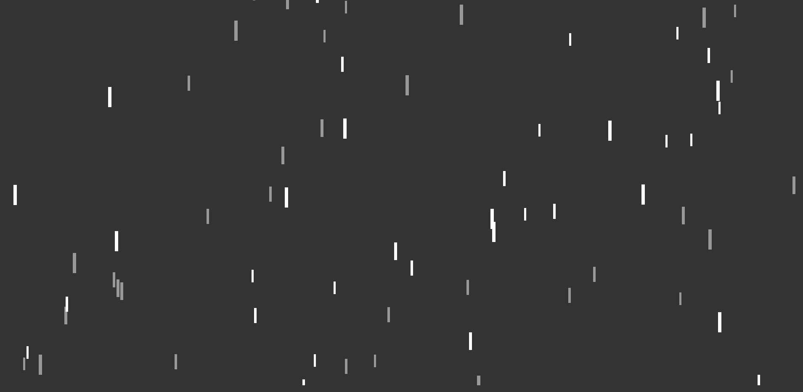

<h1 align='center'>Rain Effect</h1>

<h2 align='center'>About</h2>

<h3 align='center'>Rain effect using the html canvas</h3>

  

<h2 align='start'>You can change the rain values</h2>

<code>lengthOfRain = 100;</code>

  
<code>lengthOfRain = 300;</code>

## 🚀 Technologiess

<ul>
    <li>Javascript</li>
    <li>html</li>
    <li>css</li>
</ul>

  <h3>My linkedin</h3>
  

Made by João Pedro
